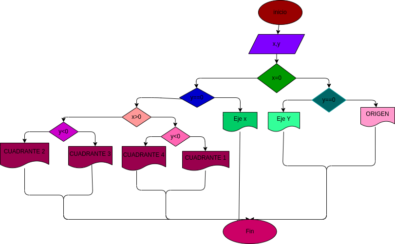

# instrucionescondicionales

# un programa lector de cordenadas cartesianas (x,y) de un punto en el plano  y calcule el cuadrante el cual le pertenece un punto

# ANALISIS

Variables de entrada y proceso (input, processing)

X,Y: Coordenadas del punto

Variables de salida

Eje x
Eje y
Origen
Cuadrante 1
cuadrante 2
cuadrante 3
cuadrante 4

Nos indica el punto exacto en el plano cartesiano

# DISEÑO

# CONSTRUCCION

